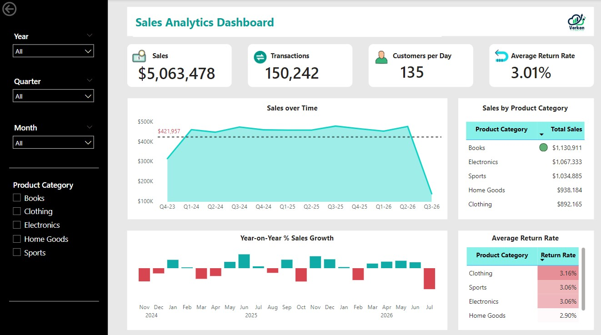

# Time Intelligence Analysis of Sales Data in Power BI

Businesses require robust analytical tools to derive insights from their sales data. This project focuses on conducting a time intelligence analysis using Power BI, leveraging an extended sales dataset. The primary goal is to analyze sales trends over time, calculate year-on-year growth, and provide actionable insights for strategic decision-making.




## Data Overview

The dataset used for this analysis includes comprehensive sales records, with the following key columns:
- **Date**: The date of each transaction
- **Total Sales**: Total sales revenue per day
- **Number of Transactions**: Count of daily transactions
- **Average Order Value**: Average sales per transaction
- **Product Category**: Category of each product sold
- **Customer Count**: Number of customers per day
- **Return Rate**: Percentage of products returned

Additionally, a separate calendar table was used for time intelligence analysis, allowing for accurate reporting across various date ranges.

## Methodology

### 1. Creating a Dedicated Calendar Table

A dedicated calendar table is essential for time intelligence analysis in Power BI. The following steps were undertaken to build the calendar:

- **Custom Calendar Period**: The calendar table was designed to accommodate custom fiscal years, allowing flexibility in reporting periods that differ from the standard calendar year.
- **Date Range**: It includes all relevant date attributes such as Year, Month, Quarter, Week, and Day, enabling detailed time-based analysis.

**DAX Code for Calendar Table:**

```DAX
Calendar = 
    VAR min_date = MIN(Sales[Date])
    VAR max_date = MAX(Sales[Date])
    RETURN CALENDAR(
        DATE(YEAR(min_date), 1, 1), DATE(YEAR(max_date), 12, 31)
    )
```

### 2. Year-on-Year Sales Growth Calculations

To assess sales performance over time, year-on-year growth was calculated using time intelligence functions in DAX:

#### **Year-to-Date (YTD) Sales Calculation**

```DAX
YTD Sales = 
    IF(
        ISINSCOPE('Calendar'[Quarter]),
        TOTALYTD(SUM(Sales[Total_Sales]), 'Calendar'[Date])
    )
```

#### **Prior Year Sales Calculation**

```DAX
PriorYearSales = 
    CALCULATE(
        SUM(Sales[Total_Sales]),
        PARALLELPERIOD('Calendar'[Date], -12, MONTH)
    )
```

#### **Year-on-Year (YoY) Growth Calculation**

```DAX
Sales YoY Growth = 
    VAR SalesPriorYear = CALCULATE(
            SUM(Sales[Total_Sales]),
            PARALLELPERIOD('Calendar'[Date], -12, MONTH)
        )
    RETURN
        DIVIDE(
            SUM(Sales[Total_Sales]) - SalesPriorYear,
            SalesPriorYear
        )
```

### 3. Sales Visualizations

A variety of visuals were created to provide actionable insights from the sales data. These visuals include:

- **Total Sales**: Shows overall sales performance over time.
- **Number of Transactions**: Displays the count of transactions per day.
- **Customers per Day**: Tracks daily customer activity.
- **Average Return Rate**: Shows the average rate of product returns over time.
- **Sales Over Time**: Displays total sales on a daily, monthly, or yearly basis.
- **Year-on-Year Sales Growth**: Provides insights into sales growth trends over the years.
- **Sales by Product Category**: Compares sales across different product categories.
- **Average Return Rate by Product Category**: Highlights return rates for each product category.

### 4. Key Insights from the Analysis

- **Sales Consistency**: Sales during weekdays and weekends were similar, showing a stable purchasing pattern.
- **Top-Selling Product Categories**: Books were the most sold category, followed by Electronics.
- **Average Return Rate**: The overall average return rate was 3.01% over the four-year period, with minimal variability. Clothing was the most returned product category, with a significant return rate of **3.45% in 2024**.

These insights help identify key trends in customer behavior, product performance, and return management, all of which can inform strategic business decisions.

## Conclusion

This project demonstrates the power of time intelligence in analyzing sales data using Power BI. By leveraging custom calendar tables and DAX functions, businesses can gain valuable insights into sales performance, identify trends, and make data-driven decisions to optimize their strategies.

## Future Work
- Add a KPI with target as the average of the preceeding years' total sales.

## How to Run the Analysis
- A YouTube video link detailing the entire process will be made available soon.
